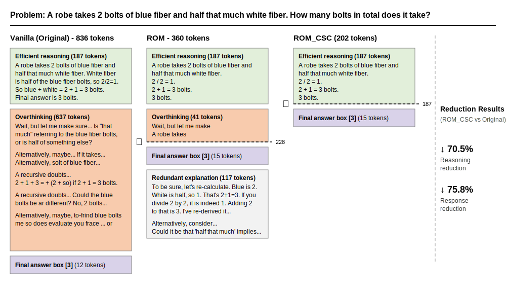

<div align="center">

# ROM: Real-time Overthinking Mitigation via Streaming Detection and Intervention

**[Xinyan Wang](https://xinyan-wang-stat.github.io/)<sup>1</sup>, [Xiaogeng Liu](https://xiaogeng-liu.com/)<sup>2</sup>, [Chaowei Xiao](https://xiaocw11.github.io/#about)<sup>2</sup>**

<sup>1</sup>University of Wisconsin-Madison &nbsp; <sup>2</sup>Johns Hopkins University

[](https://arxiv.org/abs/2603.22016)
[](https://xinyan-wang-stat.github.io/ROM/)
[](https://huggingface.co/datasets/xinyan-wang/ROM-LRM)
[](LICENSE)

</div>

## Overview

ROM is a lightweight streaming framework that detects and mitigates overthinking in Large Reasoning Models (LRMs) at the token level. It attaches a small detection head (**< 0.01%** additional parameters) to a frozen LLM backbone and monitors generation in real time, intervening when redundant reasoning is detected.

## Method

<p align="center">
  
</p>


### How ROM Works: A GSM8K Example

<p align="center">
  
</p>

## Project Structure

```
ROM/
├── rom/                        # Core package
│   ├── models.py               # StreamingHead, Qwen3WithHead
│   ├── dataset.py              # Dataset loading & embedding cache
│   ├── train.py                # Training pipeline
│   ├── eval.py                 # Offline evaluation (vLLM)
│   ├── env.py                  # Environment setup
│   └── utils/
│       ├── math.py             # Answer extraction & correctness checking
│       └── eval_helpers.py     # Metrics, probability computation
├── configs/
│   ├── train.yaml              # Training defaults
│   └── eval.yaml               # Evaluation defaults
├── requirements.txt
├── LICENSE
└── README.md
```

## Quick Start

### Installation

```bash
pip install -r requirements.txt
```

Requires Python 3.11+, PyTorch >= 2.9.0, and a CUDA-capable GPU.

### Data

Training data is hosted on HuggingFace: [xinyan-wang/ROM](https://huggingface.co/datasets/xinyan-wang/ROM).

Download and place under `data/`:
```bash
# Using huggingface-cli
huggingface-cli download xinyan-wang/ROM --repo-type dataset --local-dir data
```

### Training

All parameters are in `configs/train.yaml`. Run with defaults:

```bash
python -m rom.train
```

Override via CLI:

```bash
python -m rom.train --lr 1e-4 --num_train_epochs 30
```

W&B logging is enabled by default. Disable with `--no_wandb`.

### Evaluation

```bash
python -m rom.eval
```

Override as needed:

```bash
python -m rom.eval --ckpt_path checkpoints/my_model.pt --test_data data/test_data/math500.jsonl
```

## Citation

If you find ROM useful, please cite our paper 📝 and give us a ⭐!

```bibtex
@article{wang2025rom,
  title={ROM: Real-time Overthinking Mitigation via Streaming Detection and Intervention},
  author={Wang, Xinyan and Liu, Xiaogeng and Xiao, Chaowei},
  journal={arXiv preprint arXiv:2603.22016},
  year={2025}
}
```

## License

This project is licensed under the [MIT License](LICENSE).
